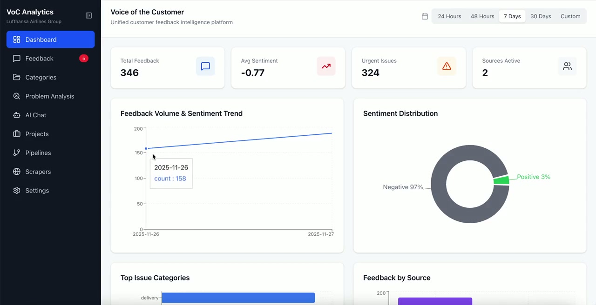

# Voice of Customer (VoC) Data Lake

## 🎬 Demo

> 📥 [Download Demo Video](static/VoC%20Demo.mp4)

[](static/VoC%20Demo.mp4)

---

A fully serverless AWS platform for ingesting, processing, and analyzing customer feedback from multiple sources using AI-powered insights with Amazon Bedrock.

## 🎯 Overview

VoC Data Lake aggregates customer feedback from review platforms, social media, app stores, and custom web sources into a unified analytics platform. It uses Amazon Bedrock (Claude Sonnet 4.5) for intelligent categorization, sentiment analysis, and actionable insights.

## ✨ Key Features

- **Multi-Source Ingestion**: Trustpilot, Google Reviews, Yelp, Twitter/X, Instagram, Facebook, Reddit, LinkedIn, TikTok, YouTube, Tavily, Apple App Store, Google Play Store, Huawei AppGallery, and custom web scrapers
- **Real-Time Processing**: Event-driven architecture with SQS queues and DynamoDB Streams
- **AI-Powered Analysis**: Amazon Bedrock for sentiment, categorization, urgency detection, persona inference, and root cause analysis
- **Multi-Language Support**: Auto-detection via Amazon Comprehend, translation via Amazon Translate
- **Visual Dashboard**: React-based UI with real-time metrics, charts, and social feed
- **Secure Authentication**: Amazon Cognito with admin/viewer role-based access
- **Project Management**: Create projects, generate personas with AI avatars, PRDs, PR/FAQs from customer feedback
- **Research Workflows**: Step Functions orchestration for complex multi-step analysis
- **Webhook Support**: Real-time ingestion via API Gateway webhooks
- **Custom Scrapers**: Visual scraper builder with AI-powered CSS selector detection
- **Embeddable Feedback Forms**: Collect feedback directly from customers via configurable forms
- **API Protection**: WAF with rate limiting, SQL injection, and XSS protection

## 🏗️ Architecture

```
┌──────────────────────────────────────────────────────────────────────────────────┐
│                              INGESTION LAYER                                      │
├──────────────────────────────────────────────────────────────────────────────────┤
│                                                                                   │
│  ┌──────────┐ ┌──────────┐ ┌──────────┐ ┌──────────┐ ┌──────────┐ ┌──────────┐ │
│  │Trustpilot│ │   Yelp   │ │  Google  │ │ Twitter  │ │   Meta   │ │  Reddit  │ │
│  │   API    │ │   API    │ │ Reviews  │ │   API    │ │Graph API │ │   API    │ │
│  └────┬─────┘ └────┬─────┘ └────┬─────┘ └────┬─────┘ └────┬─────┘ └────┬─────┘ │
│       │            │            │            │            │            │        │
│  ┌────┴─────┐ ┌────┴─────┐ ┌────┴─────┐ ┌────┴─────┐ ┌────┴─────┐ ┌────┴─────┐ │
│  │ App Store│ │  Tavily  │ │   Web    │ │Trustpilot│ │ Feedback │ │ LinkedIn │ │
│  │   APIs   │ │   API    │ │ Scrapers │ │ Webhook  │ │  Forms   │ │ TikTok   │ │
│  └────┬─────┘ └────┬─────┘ └────┬─────┘ └────┬─────┘ └────┬─────┘ └────┬─────┘ │
│       │            │            │            │            │            │        │
│       └────────────┴────────────┴────────────┴────────────┴────────────┘        │
│                                      │                                           │
│                    ┌─────────────────┴─────────────────┐                         │
│                    │  16 Lambda Ingestors              │                         │
│                    │  (EventBridge Scheduled 1-30min)  │                         │
│                    └─────────────────┬─────────────────┘                         │
│                                      │                                           │
│                    ┌─────────────────┴─────────────────┐                         │
│                    │  DynamoDB: voc-watermarks         │                         │
│                    │  (Ingestion state tracking)       │                         │
│                    └───────────────────────────────────┘                         │
│                                      │                                           │
└──────────────────────────────────────┼───────────────────────────────────────────┘
                                       │
                                       ▼
┌──────────────────────────────────────────────────────────────────────────────────┐
│                            PROCESSING LAYER                                       │
├──────────────────────────────────────────────────────────────────────────────────┤
│                                                                                   │
│                    ┌───────────────────────────────────┐                         │
│                    │  SQS: voc-processing-queue        │                         │
│                    │  (with DLQ for failed messages)   │                         │
│                    └─────────────────┬─────────────────┘                         │
│                                      │                                           │
│                    ┌─────────────────┴─────────────────┐                         │
│                    │  Processor Lambda (1024MB, 5min)  │                         │
│                    │  - Bedrock (Claude Sonnet 4.5)    │                         │
│                    │  - Comprehend (Sentiment, NLP)    │                         │
│                    │  - Translate (Multi-language)     │                         │
│                    └─────────────────┬─────────────────┘                         │
│                                      │                                           │
└──────────────────────────────────────┼───────────────────────────────────────────┘
                                       │
                                       ▼
┌──────────────────────────────────────────────────────────────────────────────────┐
│                              STORAGE LAYER                                        │
├──────────────────────────────────────────────────────────────────────────────────┤
│                                                                                   │
│  ┌────────────────────────────────────────────────────────────────────────────┐  │
│  │  DynamoDB: voc-feedback (KMS encrypted, on-demand)                         │  │
│  │  - PK: SOURCE#{platform}  SK: FEEDBACK#{id}                                │  │
│  │  - GSI1: by-date (DATE#{yyyy-mm-dd})                                       │  │
│  │  - GSI2: by-category (CATEGORY#{category})                                 │  │
│  │  - GSI3: by-urgency (URGENCY#{level})                                      │  │
│  │  - Streams: NEW_AND_OLD_IMAGES                                             │  │
│  └────────────────────────────────┬───────────────────────────────────────────┘  │
│                                   │ DynamoDB Streams                              │
│                                   ▼                                               │
│  ┌────────────────────────────────────────────────────────────────────────────┐  │
│  │  Aggregator Lambda (Real-time metrics)                                     │  │
│  │  - Daily totals, sentiment averages                                        │  │
│  │  - Category/source/persona breakdowns                                      │  │
│  └────────────────────────────────┬───────────────────────────────────────────┘  │
│                                   │                                               │
│                                   ▼                                               │
│  ┌────────────────────────────────────────────────────────────────────────────┐  │
│  │  DynamoDB: voc-aggregates (Pre-computed metrics)                           │  │
│  │  - METRIC#daily_total, METRIC#daily_sentiment#{label}                      │  │
│  │  - METRIC#daily_category#{cat}, METRIC#daily_source#{src}                  │  │
│  │  - METRIC#persona#{name}, METRIC#urgent                                    │  │
│  └────────────────────────────────────────────────────────────────────────────┘  │
│                                                                                   │
│  ┌────────────────────────────────────────────────────────────────────────────┐  │
│  │  DynamoDB: voc-projects, voc-jobs, voc-conversations                       │  │
│  └────────────────────────────────────────────────────────────────────────────┘  │
│                                                                                   │
│  ┌────────────────────────────────────────────────────────────────────────────┐  │
│  │  S3: voc-raw-data (Raw data lake + persona avatars)                        │  │
│  └────────────────────────────────────────────────────────────────────────────┘  │
│                                                                                   │
└──────────────────────────────────────┬────────────────────────────────────────────┘
                                       │
                                       ▼
┌──────────────────────────────────────────────────────────────────────────────────┐
│                             ANALYTICS LAYER                                       │
├──────────────────────────────────────────────────────────────────────────────────┤
│                                                                                   │
│  ┌────────────────────────────────────────────────────────────────────────────┐  │
│  │  API Gateway REST API (Cognito auth, WAF protected, throttled 100 req/s)   │  │
│  │                                                                             │  │
│  │  ┌──────────────┐ ┌──────────────┐ ┌──────────────┐ ┌──────────────┐       │  │
│  │  │ Metrics API  │ │  Chat API    │ │ Projects API │ │  Users API   │       │  │
│  │  │ /feedback/*  │ │ /chat/*      │ │ /projects/*  │ │ /users/*     │       │  │
│  │  │ /metrics/*   │ │              │ │              │ │              │       │  │
│  │  └──────────────┘ └──────────────┘ └──────────────┘ └──────────────┘       │  │
│  │                                                                             │  │
│  │  ┌──────────────┐ ┌──────────────┐ ┌──────────────┐ ┌──────────────┐       │  │
│  │  │Integrations  │ │ Scrapers API │ │ Settings API │ │Feedback Forms│       │  │
│  │  │/integrations │ │ /scrapers/*  │ │ /settings/*  │ │/feedback-form│       │  │
│  │  │/sources/*    │ │              │ │              │ │              │       │  │
│  │  └──────────────┘ └──────────────┘ └──────────────┘ └──────────────┘       │  │
│  └────────────────────────────────────────────────────────────────────────────┘  │
│                                                                                   │
│  ┌────────────────────────────────────────────────────────────────────────────┐  │
│  │  Chat Stream Lambda (Function URL for streaming, bypasses 29s timeout)     │  │
│  └────────────────────────────────────────────────────────────────────────────┘  │
│                                                                                   │
│  ┌────────────────────────────────────────────────────────────────────────────┐  │
│  │  Step Functions: Research Workflow (Multi-step analysis orchestration)     │  │
│  └────────────────────────────────────────────────────────────────────────────┘  │
│                                                                                   │
└──────────────────────────────────────┬────────────────────────────────────────────┘
                                       │
                                       ▼
┌──────────────────────────────────────────────────────────────────────────────────┐
│                           PRESENTATION LAYER                                      │
├──────────────────────────────────────────────────────────────────────────────────┤
│                                                                                   │
│  ┌────────────────────────────────────────────────────────────────────────────┐  │
│  │  CloudFront Distribution (HTTPS, edge caching)                             │  │
│  │  └─▶ S3 Bucket (React SPA - Vite build)                                    │  │
│  └────────────────────────────────────────────────────────────────────────────┘  │
│                                                                                   │
│  ┌────────────────────────────────────────────────────────────────────────────┐  │
│  │  React Dashboard (Zustand + TanStack Query + Cognito Auth)                 │  │
│  │  - Login: Cognito authentication                                           │  │
│  │  - Dashboard: Metrics, charts, social feed                                 │  │
│  │  - Feedback: Filterable list, search, detail view                          │  │
│  │  - Projects: Personas, PRDs, PR/FAQs, research                             │  │
│  │  - Chat: AI-powered conversational analytics with streaming                │  │
│  │  - Settings: Brand config, integrations, user admin                        │  │
│  └────────────────────────────────────────────────────────────────────────────┘  │
│                                                                                   │
└───────────────────────────────────────────────────────────────────────────────────┘

┌──────────────────────────────────────────────────────────────────────────────────┐
│                          SUPPORTING SERVICES                                      │
├──────────────────────────────────────────────────────────────────────────────────┤
│  • Cognito User Pool: Authentication with admin/viewer groups                    │
│  • WAF: API protection (rate limiting, SQL injection, XSS)                       │
│  • Secrets Manager: API credentials (auto-rotation capable)                      │
│  • KMS: Customer-managed key for encryption at rest                              │
│  • CloudWatch Logs: 2-week retention for all Lambdas                             │
│  • X-Ray: Distributed tracing via Powertools                                     │
│  • EventBridge: Scheduled rules for ingestion (1-30 min intervals)               │
└───────────────────────────────────────────────────────────────────────────────────┘
```

## 🚀 Quick Start

### Prerequisites

- AWS Account with appropriate permissions
- AWS CLI configured
- Node.js 18+ and npm
- Python 3.12+
- Docker (for building Lambda layers)
- AWS CDK CLI (`npm install -g aws-cdk`)

### Deployment

1. **Clone the repository**
   ```bash
   git clone https://github.com/mundurragacl/voice-of-customer-datalake.git
   cd voice-of-customer-datalake
   ```

2. **Build Lambda layers (requires Docker)**
   ```bash
   cd voc-datalake
   ./scripts/build-layers.sh
   ```

3. **Build and deploy CDK stacks**
   ```bash
   npm install
   npm run build
   npx cdk bootstrap  # First time only
   npx cdk deploy --all --context frontendDomain=your-domain.cloudfront.net
   ```

4. **Deploy frontend**
   ```bash
   cd frontend
   npm install
   npm run build
   # Frontend is automatically deployed via CDK FrontendStack
   ```

5. **Create initial admin user**
   ```bash
   aws cognito-idp admin-create-user \
     --user-pool-id <user-pool-id> \
     --username admin@example.com \
     --user-attributes Name=email,Value=admin@example.com \
     --temporary-password 'TempPass123!'
   
   aws cognito-idp admin-add-user-to-group \
     --user-pool-id <user-pool-id> \
     --username admin@example.com \
     --group-name admins
   ```

For detailed deployment instructions, see [voc-datalake/README.md](voc-datalake/README.md).

### Configuration

1. **Brand Settings** (Settings page)
   - Brand Name
   - Social Media Handles
   - Hashtags to Track
   - URLs to Monitor

2. **Data Source Credentials** (Settings → Integrations)
   - Trustpilot: API Key, Secret, Business Unit ID
   - Yelp: API Key, Business IDs
   - Google Reviews: API Key, Location IDs
   - Twitter/X: Bearer Token
   - Meta (Instagram/Facebook): Access Token
   - Reddit: Client ID, Secret
   - LinkedIn: Access Token
   - TikTok: Access Token
   - YouTube: API Key
   - Tavily: API Key
   - App Stores: App IDs, Service Accounts

3. **Enable/Disable Sources** (Settings → Data Sources)
   - Toggle EventBridge schedules for each source
   - Configure ingestion frequency

## 📊 Tech Stack

### Infrastructure
- **AWS CDK**: Infrastructure as Code (TypeScript)
- **DynamoDB**: Serverless NoSQL database with on-demand billing
- **Lambda**: Python 3.12 with ARM64 (Graviton) and Powertools
- **API Gateway**: REST API with Cognito authentication
- **Cognito**: User authentication with admin/viewer groups
- **WAF**: API protection with managed rules
- **EventBridge**: Scheduled ingestion (1-30 min intervals)
- **SQS**: Processing queue with DLQ
- **Step Functions**: Research workflow orchestration
- **Secrets Manager**: API credential storage
- **KMS**: Encryption at rest
- **CloudFront + S3**: Frontend hosting

### AI/ML Services
- **Amazon Bedrock**: Claude Sonnet 4.5 via global inference profile
- **Amazon Comprehend**: Sentiment analysis, language detection, key phrases
- **Amazon Translate**: Multi-language support

### Frontend
- **React 19**: UI framework
- **Vite 7**: Build tool
- **Tailwind CSS 4**: Styling
- **Zustand**: State management
- **TanStack Query**: Data fetching/caching
- **React Router 7**: Routing
- **Recharts**: Charts and visualizations
- **amazon-cognito-identity-js**: Authentication

## 📁 Project Structure

```
voice-of-customer-datalake/
├── README.md                   # This file - project overview
├── .gitignore
├── .kiro/steering/             # Project guidelines and standards
└── voc-datalake/               # Main CDK application
    ├── README.md               # CDK deployment guide
    ├── bin/                    # CDK app entry point
    ├── lib/stacks/             # CDK stack definitions
    │   ├── storage-stack.ts    # DynamoDB tables, S3, KMS
    │   ├── auth-stack.ts       # Cognito User Pool
    │   ├── ingestion-stack.ts  # Ingestors, EventBridge, SQS
    │   ├── processing-stack.ts # Processor, Aggregator
    │   ├── analytics-stack.ts  # API Gateway, API Lambdas, WAF
    │   ├── research-stack.ts   # Step Functions workflows
    │   └── frontend-stack.ts   # CloudFront, S3
    ├── lambda/
    │   ├── ingestors/          # 16 data source ingestors
    │   ├── processor/          # Bedrock/Comprehend enrichment
    │   ├── aggregator/         # Real-time metrics
    │   ├── api/                # 12 domain-specific API handlers
    │   ├── webhooks/           # Webhook receivers
    │   ├── research/           # Research step functions
    │   ├── shared/             # Shared utilities
    │   └── layers/             # Lambda layers
    ├── frontend/               # React dashboard
    │   ├── src/
    │   │   ├── pages/          # 14 pages
    │   │   ├── components/     # 22 components
    │   │   ├── api/            # API client
    │   │   ├── services/       # Auth service
    │   │   ├── store/          # Zustand stores
    │   │   └── config.ts       # Runtime configuration
    │   └── public/
    ├── schemas/                # JSON schemas
    ├── prompts/                # Bedrock prompts
    ├── docs/                   # Documentation
    │   └── default-scrapers.md # Default scraper configurations
    └── scripts/                # Utility scripts
        ├── build-layers.sh     # Build Lambda layers (Docker)
        ├── deploy.sh           # Full deployment
        ├── deploy-frontend.sh  # Frontend only
        ├── test-api.sh         # API validation
        └── *.py                # Data management scripts
```

## 🔐 Security

- **Authentication**: Cognito User Pool with admin/viewer groups
- **API Protection**: WAF with rate limiting, SQL injection, XSS protection
- **Encryption**: KMS encryption at rest for all DynamoDB tables and S3
- **IAM**: Least-privilege roles for all Lambda functions (domain-isolated)
- **Secrets**: API credentials stored in Secrets Manager
- **CORS**: Configured for CloudFront origin only

## 💰 Cost Optimization

- **DynamoDB**: On-demand billing, TTL for old data
- **Lambda**: ARM64 (Graviton) for better price/performance, right-sized memory
- **Bedrock**: Claude Sonnet 4.5 for cost-effective inference
- **CloudFront**: Edge caching for frontend assets
- **EventBridge**: Configurable schedules to control ingestion frequency

## 📈 Monitoring

- **CloudWatch Logs**: All Lambda functions with 2-week retention
- **X-Ray Tracing**: Distributed tracing via Powertools
- **Custom Metrics**: Lambda Powertools metrics for business KPIs
- **WAF Metrics**: Request counts, blocked requests

## 🛠️ Development

### Local Development

```bash
# Frontend dev server
cd voc-datalake/frontend
npm run dev  # http://localhost:5173

# Mock API server
npm run mock  # http://localhost:3001
```

### Adding a New Data Source

1. Create `lambda/ingestors/{source}/handler.py`
2. Inherit from `BaseIngestor`
3. Implement `fetch_new_items()` generator
4. Add to `ingestion-stack.ts`
5. Add credentials to Secrets Manager
6. Update frontend Settings page

## 📝 API Endpoints

| Method | Path | Description |
|--------|------|-------------|
| GET | `/feedback` | List feedback with filters |
| GET | `/feedback/{id}` | Get single feedback item |
| GET | `/feedback/urgent` | Get high-urgency items |
| GET | `/metrics/summary` | Dashboard metrics |
| GET | `/metrics/sentiment` | Sentiment breakdown |
| GET | `/metrics/categories` | Category breakdown |
| POST | `/chat` | AI chat endpoint |
| GET | `/projects` | List projects |
| POST | `/projects` | Create project |
| POST | `/projects/{id}/personas/generate` | Generate personas |
| POST | `/projects/{id}/research` | Run research workflow |
| GET | `/users` | List users (admin) |
| POST | `/users` | Create user (admin) |
| GET | `/settings/brand` | Get brand configuration |
| PUT | `/settings/brand` | Save brand configuration |
| POST | `/feedback-form/submit` | Submit feedback (public) |

## 📄 License

Proprietary - All rights reserved

## 🙏 Acknowledgments

- Built with AWS CDK and serverless best practices
- Powered by Amazon Bedrock (Claude Sonnet 4.5)
- UI inspired by modern SaaS analytics platforms
